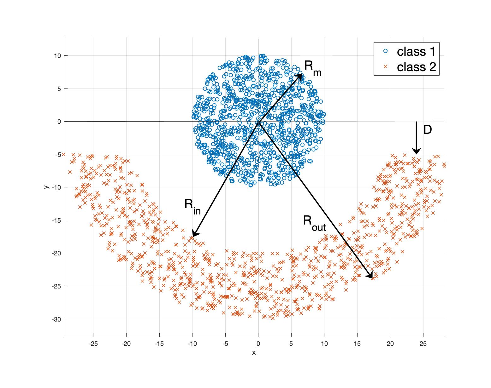
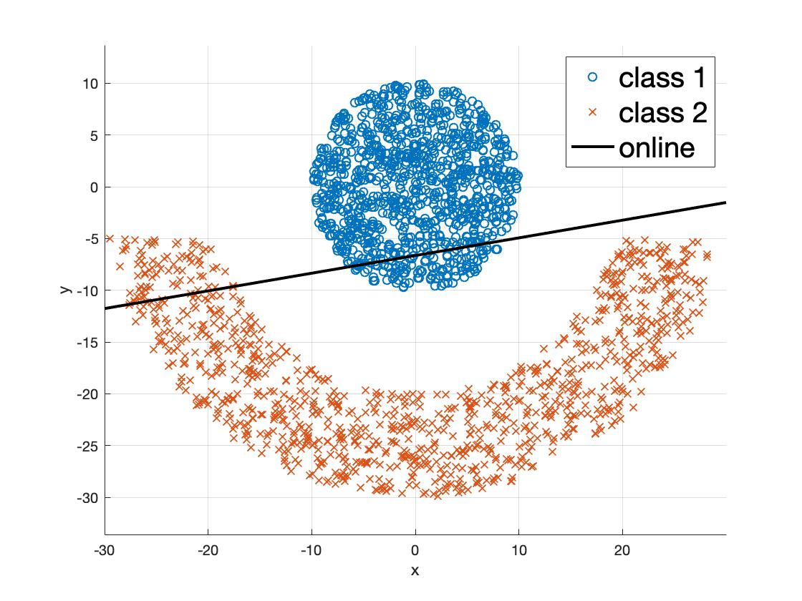
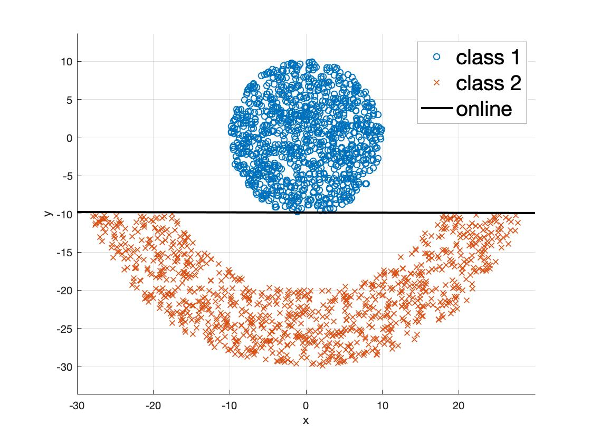
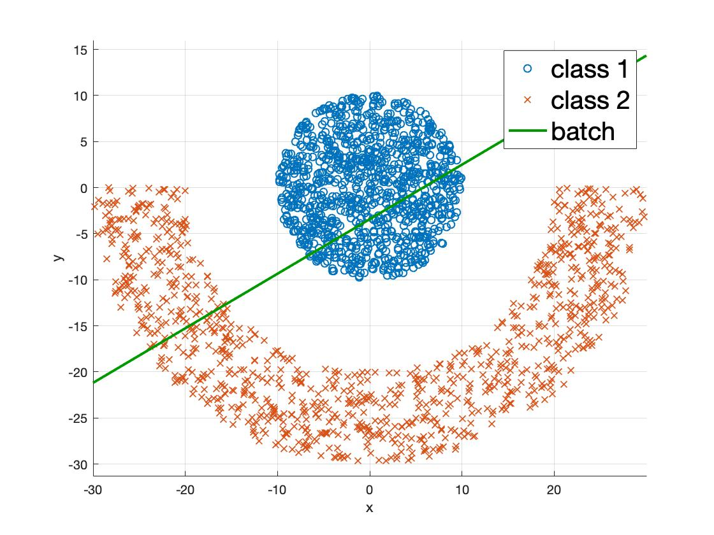
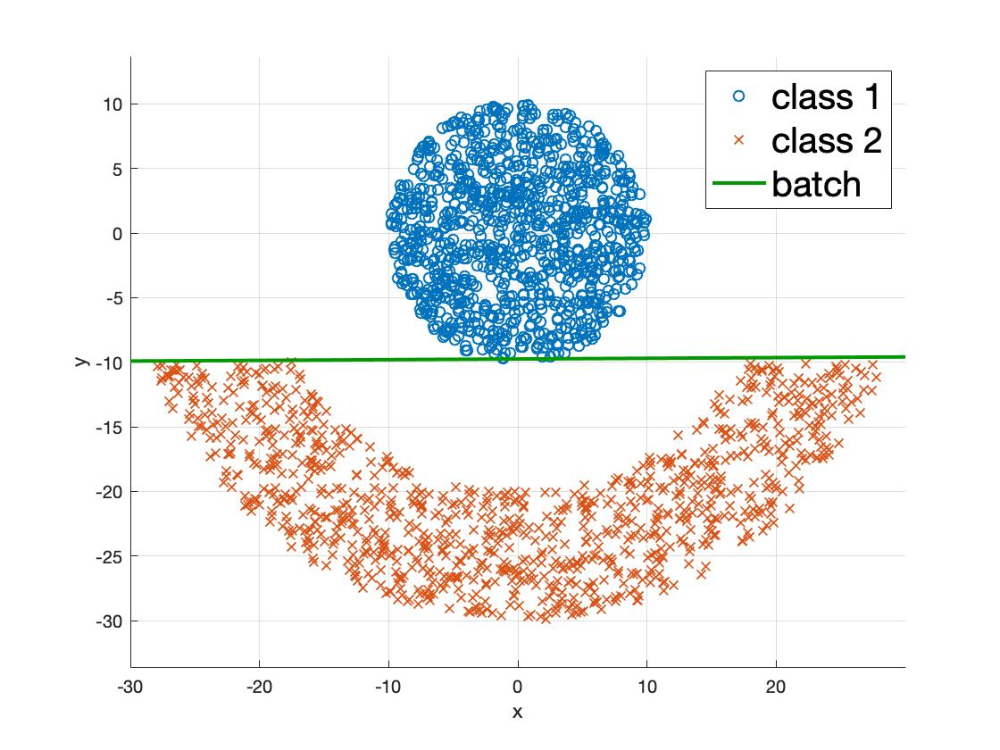
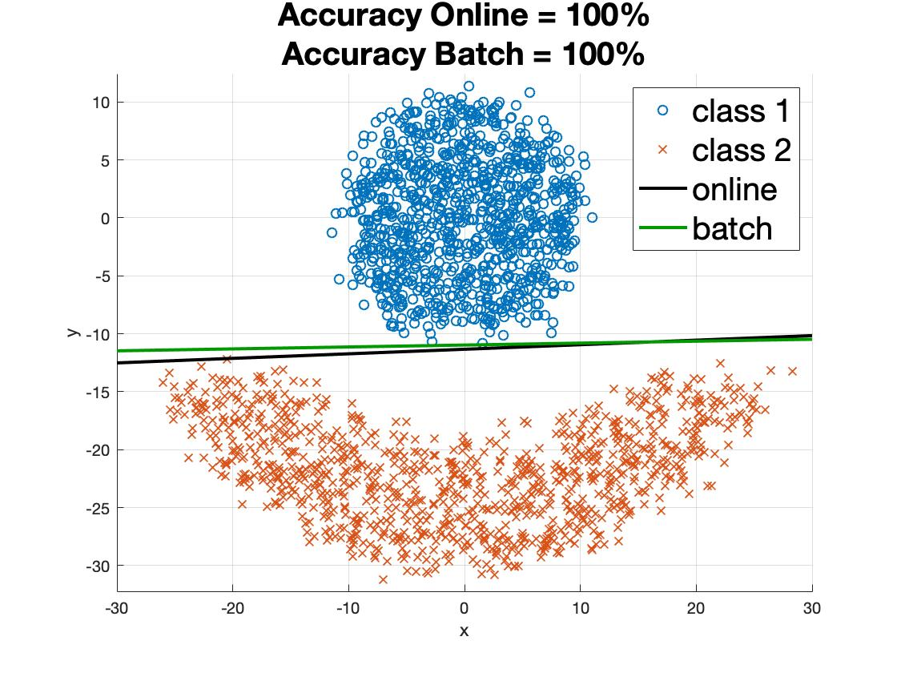
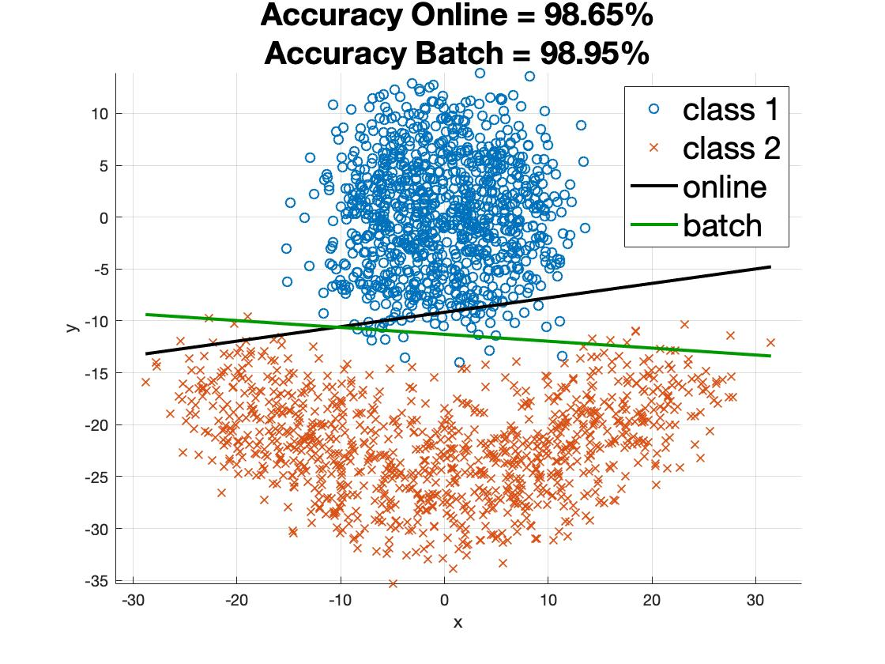

# Assignment-1

All the codes have been implemented in MATLAB.

A basic Perceptron Algorithm was implemented as a part of this assignment. The codes correspond to Problem-5 of the file [NNLS_2019_HW1.pdf]. 

To get started, run the Test.m file.

[NNLS_2019_HW1.pdf]: https://github.com/ocimakamboj/NNLS/blob/master/Assignment-1/NNLS_2019_HW1.pdf

The following data has to be classified - 

   

### Results for Online Learning

Left - D=5, Right - D=10

   

### Results for Batch Learning

Left - D=0, Right - D=10

   

### Results with noisy data

Gaussian noise is added to the data belonging to both the classes.\
Left - Variance=1, Right - Variance=4

   

