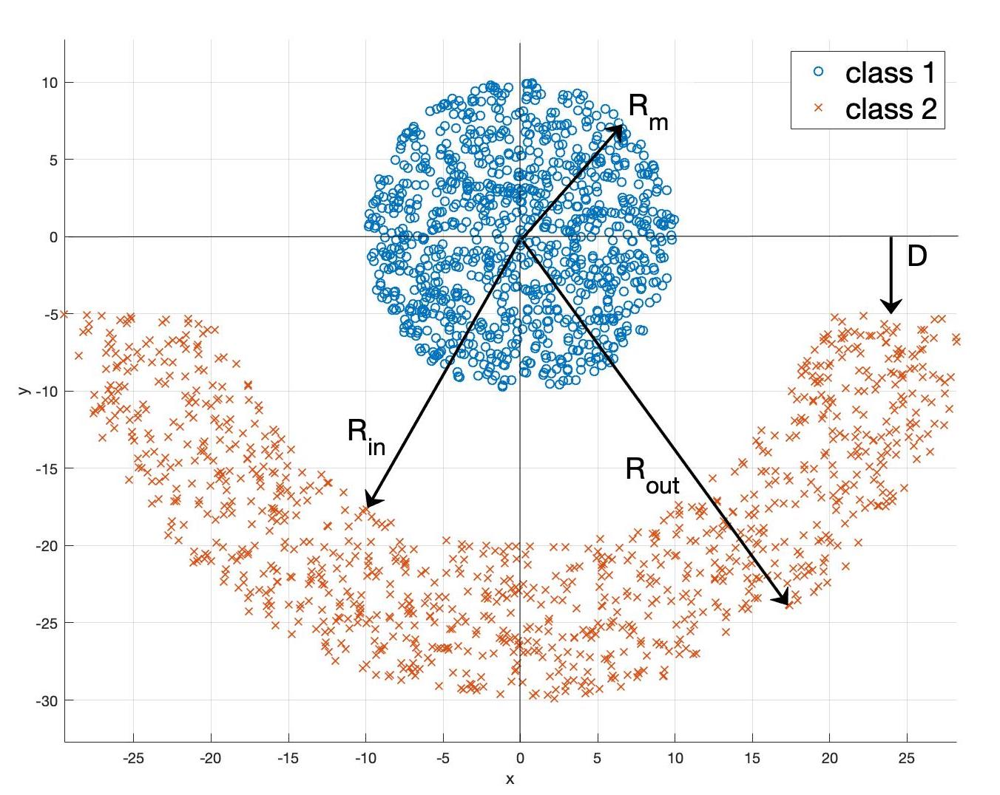

# Assignment-1

All the codes have been implemented in MATLAB.

A basic Perceptron Algorithm was implemented as a part of this assignment. The codes correspond to Problem-5 of the file [NNLS_2019_HW1.pdf]. 

To get started, run the Test.m file.

Some of the results have been shown below.

[NNLS_2019_HW1.pdf]: https://github.com/ocimakamboj/NNLS/blob/master/Assignment-1/NNLS_2019_HW1.pdf

The following data has to be classified - 

   
<figcaption>This is my caption text.</figcaption> 

	

		
		
caption 1

	

	

		
		
caption 2

	

.column div {
  float: left;
  width: 50%;
  padding: 5px;
}
