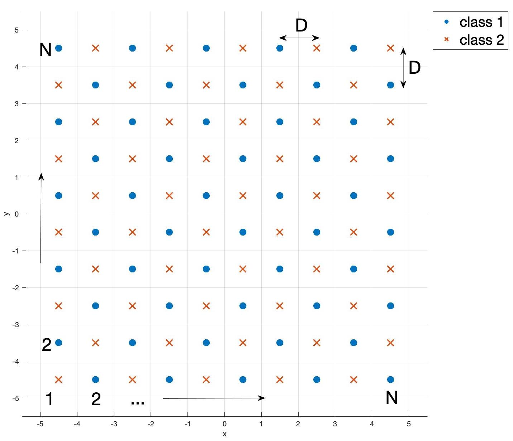
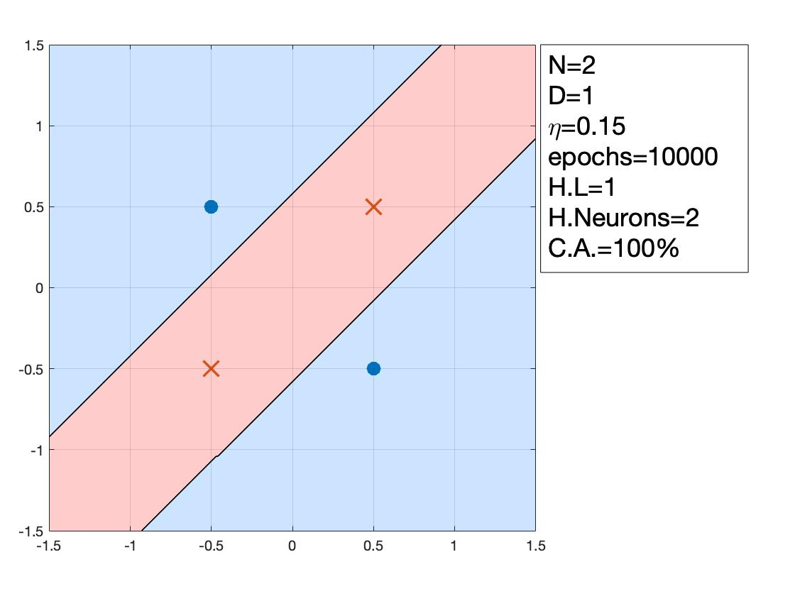
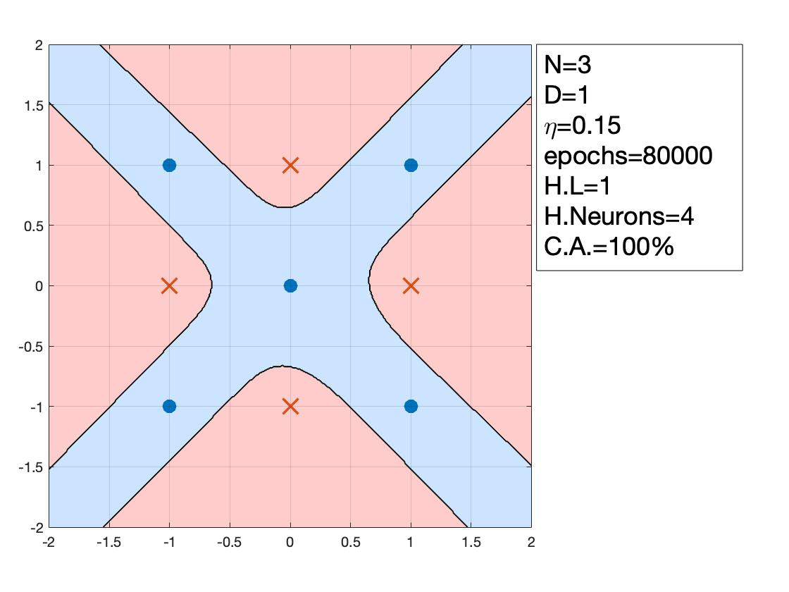
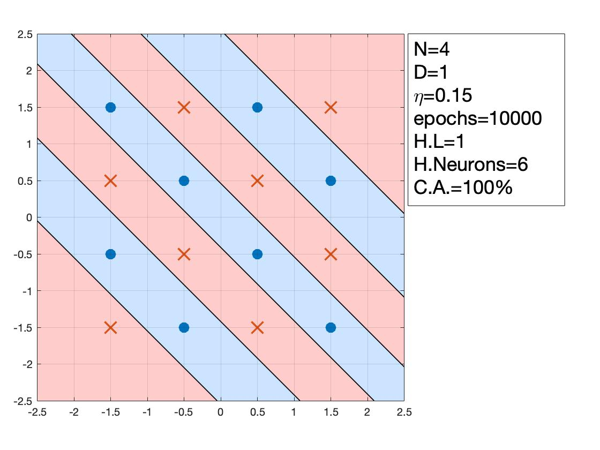
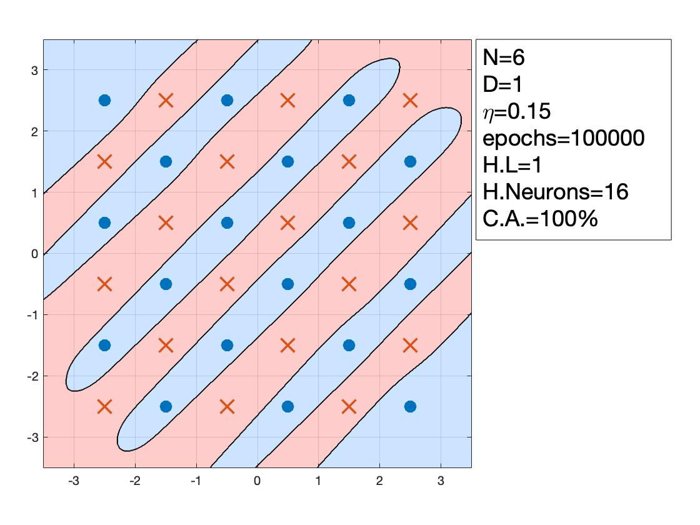
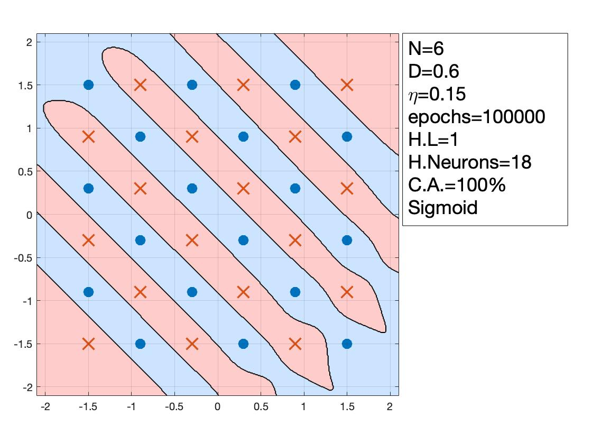
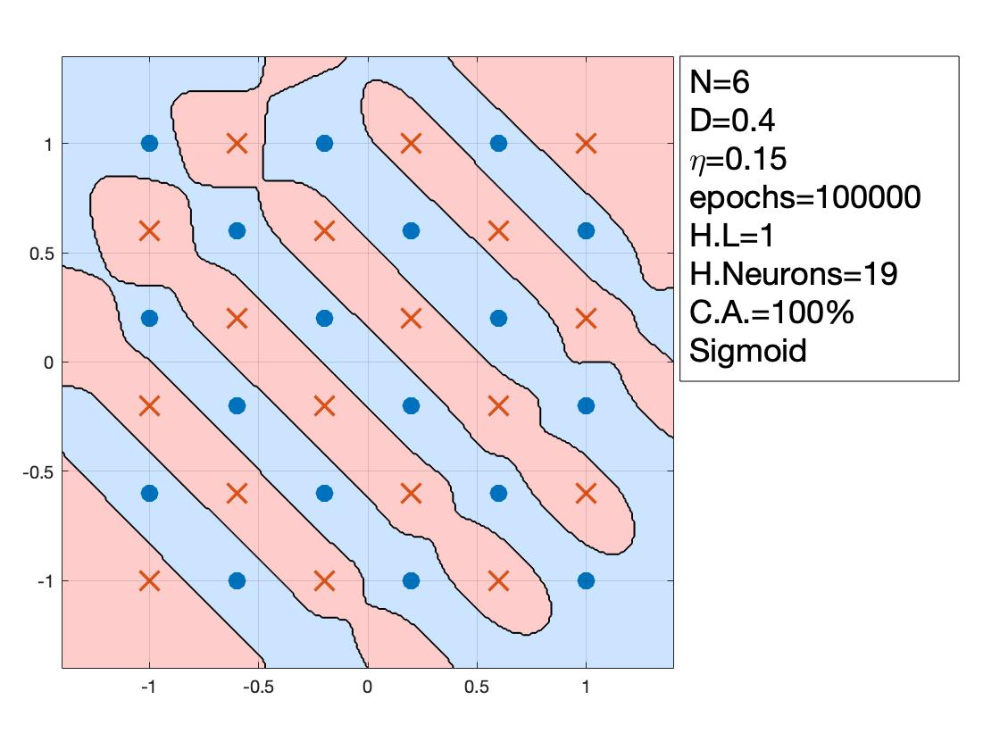
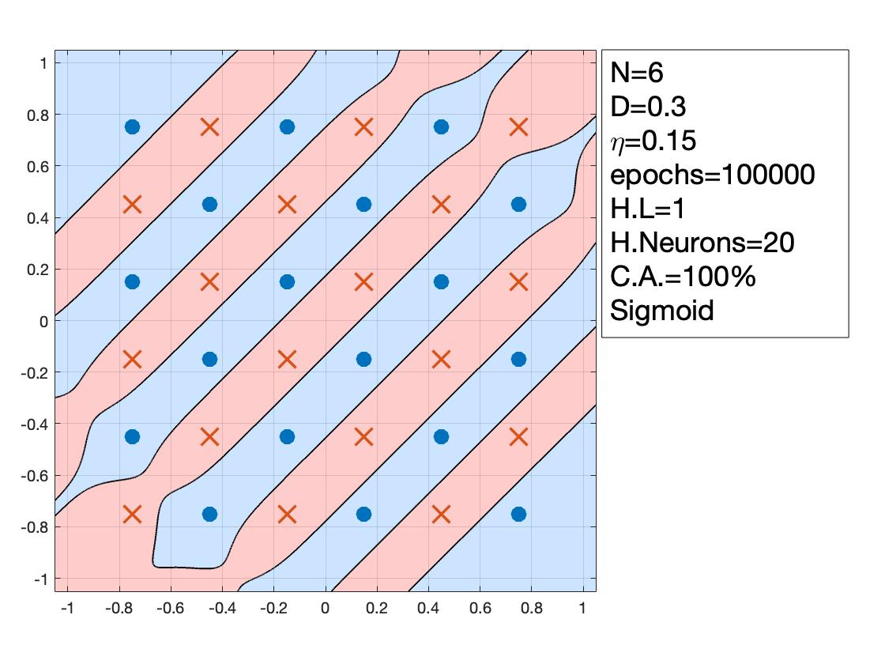
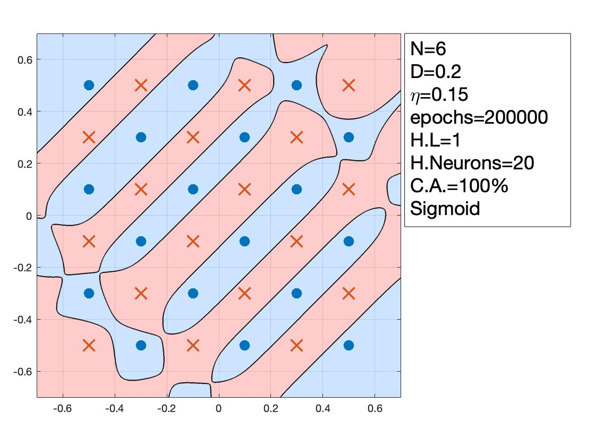
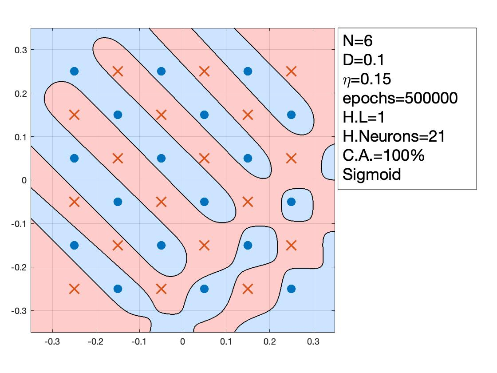

# Assignment-2

All the codes have been implemented in MATLAB.

Multilayer Perceptron Algorithm was implemented as a part of this assignment. The codes correspond to Problem-3 of the file [NNLS_2019_HW2]. The full report is here [NNLS_Report].

To get started, run the Test.m file.

[NNLS_2019_HW2]: https://github.com/ocimakamboj/NNLS/blob/master/Assignment-2/NNLS_2019_HW2.pdf
[NNLS_Report]: https://github.com/ocimakamboj/NNLS/blob/master/Assignment-2/HW-2.pdf

The following data has to be classified - 

   

### Notation followed in Plots

N - size of the grid\
D - Distance between two adjacent dot and cross\
&eta; - learning rate\
epochs - the no. of epochs for which the MLP algorithm was run\
H.L. - the number of hidden layers\
H.Neurons - an array of the number of neurons in each hidden layer\
C.A. - Classification Accuracy on the dataset

 
### Results with D fixed and sigmoid activation

   
   

### Results when D is varied

   
   
  

