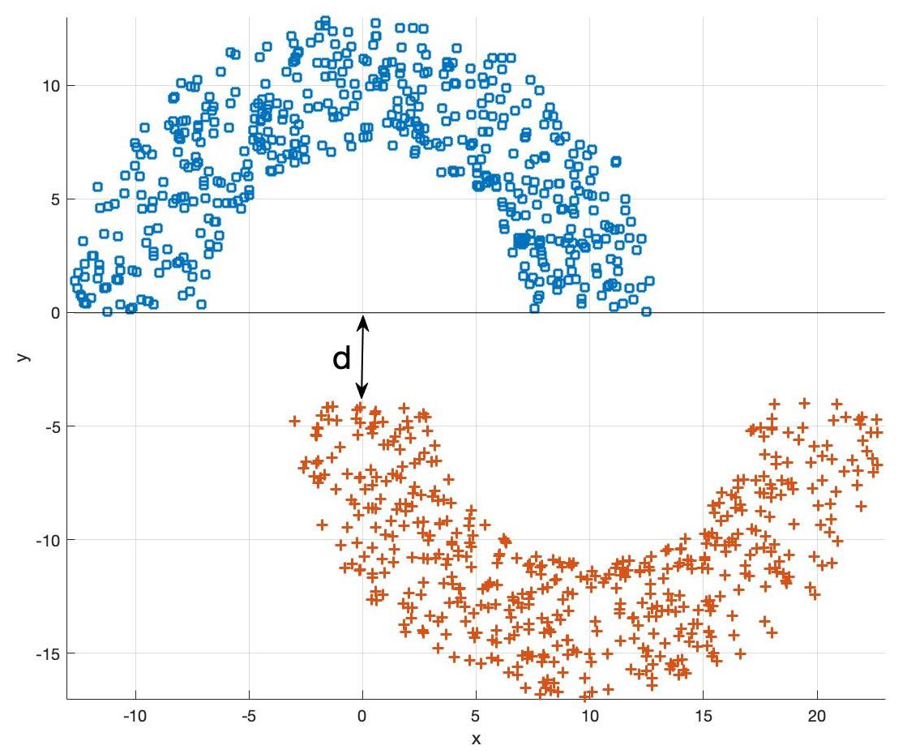
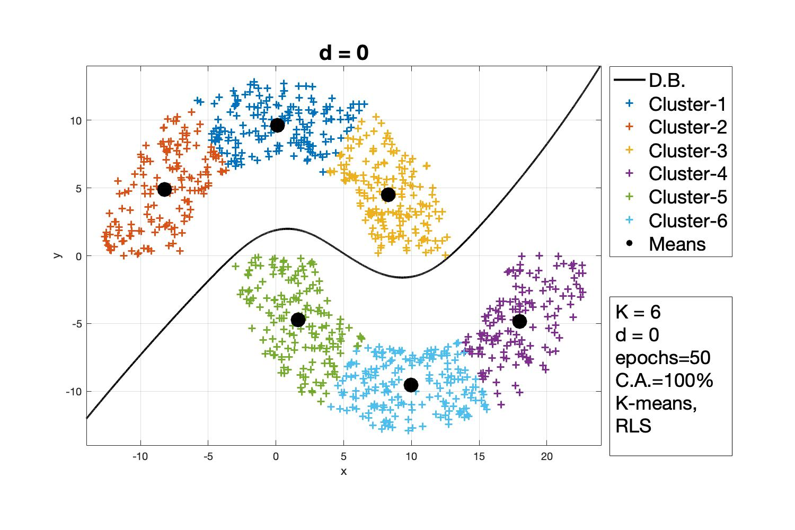
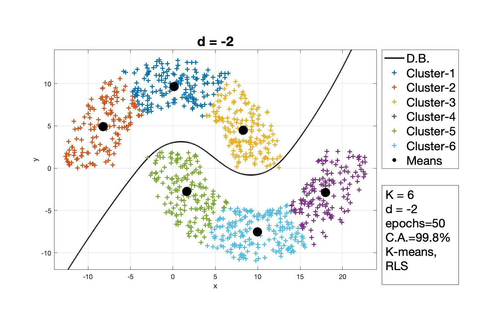
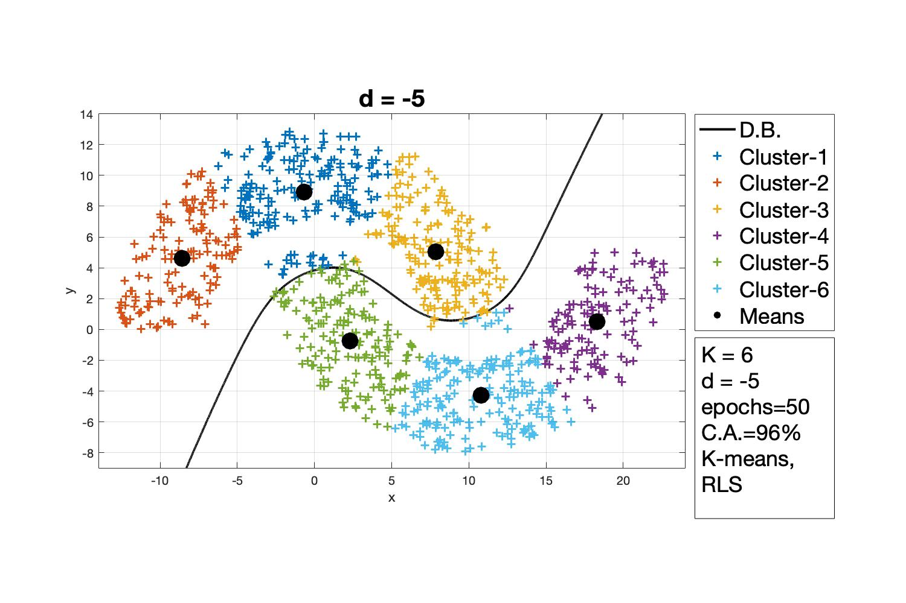
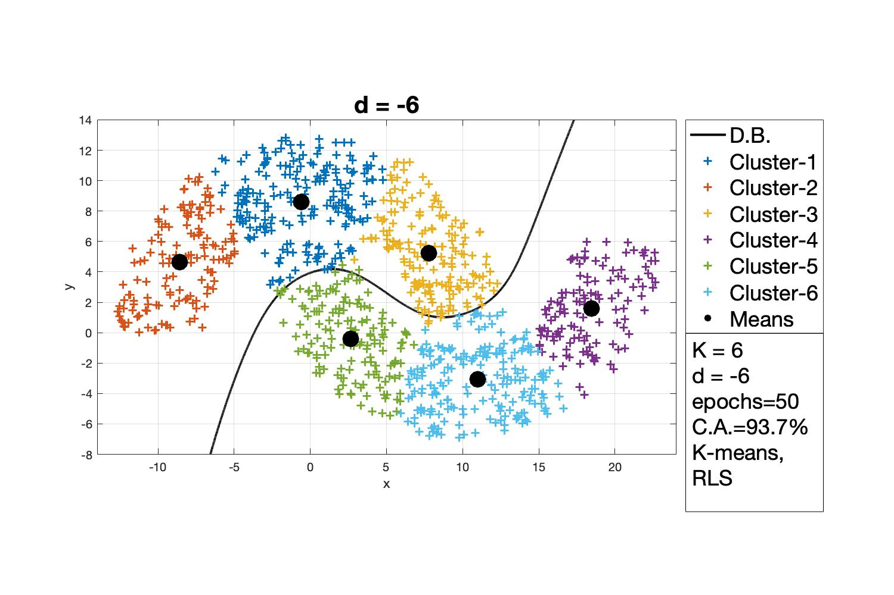
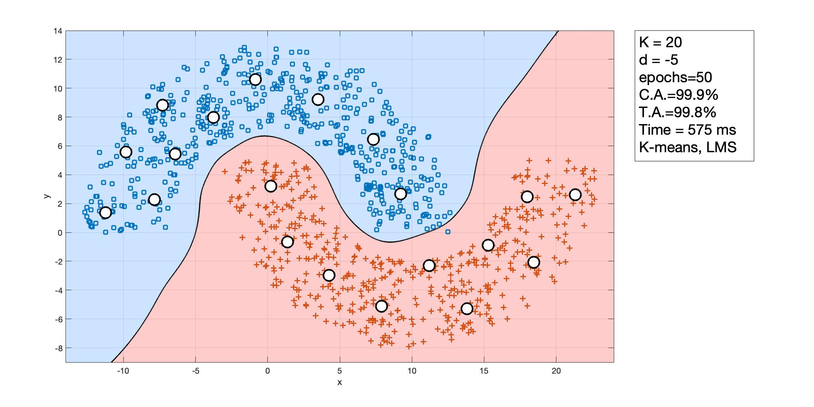

# Assignment-2

All the codes have been implemented in MATLAB.

Multilayer Perceptron Algorithm was implemented as a part of this assignment. The codes correspond to Problem-3 of the file [Questions]. The full report is here [HW-3].

To get started, run the kmeansTest.m file for the first question, and the Test.m file for the second question.

[Questions]: https://github.com/ocimakamboj/NNLS/blob/master/Assignment-3/Questions.png
[HW-3]: https://github.com/ocimakamboj/NNLS/blob/master/Assignment-3/HW-3.pdf

The following data has to be classified - 

   

### Notation followed in Plots

K - No. of clusters\
D.B - Decision Boundary\
d - distance between the two half moons as shown in the figure above\
epochs - the no. of epochs for which the MLP algorithm was run\
C.A. - Classification Accuracy on the training dataset\
T.A - Testing Accuracy, that is the accuracy achieved on test dataset\
K-means, RLS - Recursive Least Square Implementation of Radial Basis Function Network\ 
K-means, LMS - Least Mean Square Implementation of Radial Basis Function Network
 
### Results when D is varied

   
   

### Results - K-means, RLS vs. K-means, LMS

  
  

